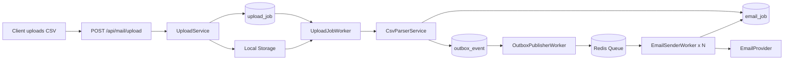

# Mail Service

Mail Service is an asynchronous CSV-based email processing service. The goal of Phase 1 was to separate upload, CSV parsing, job persistence, queue publishing, and email delivery into distinct stages so the system is easier to scale, benchmark, and improve over time.

This document is the Phase 1 summary: what the system currently does, how to run it, what the benchmark actually shows, and which improvements should be prioritized next.

## 1. Phase 1 Goals

- Build an end-to-end flow: upload CSV -> create email jobs -> enqueue jobs -> send emails concurrently.
- Separate ingestion and delivery using `upload_job`, `email_job`, and `outbox_event`.
- Measure the system with tests instead of relying on assumptions.
- Create a foundation for future throughput and reliability improvements.

## 2. Current Architecture

### Main components

- `EmailController`: accepts CSV uploads through `POST /api/mail/upload`.
- `UploadService`: stores the uploaded file and creates an `upload_job`.
- `UploadJobWorker`: polls `PENDING` upload jobs, parses CSV, and creates batch data.
- `CsvParserService` + `EmailJobBatchService`: create `email_job` and `outbox_event` records and persist them in batches.
- `OutboxPublisherWorker`: reads new `outbox_event` records and publishes payloads to Redis.
- `EmailSenderWorker`: runs multiple sender threads, consumes the queue, calls `EmailProvider`, and retries when needed.
- `MockEmailProvider` / `AwsSesProvider`: provider abstraction for local testing or AWS SES integration.

### High-level flow



Detailed flow documentation is available in [docs/PHASE_1_ARCHITECTURE.md](/D:/JavaProject/mailservice/docs/PHASE_1_ARCHITECTURE.md).

## 3. Tech Stack

- Java 17
- Spring Boot 4.0.1
- Spring Web MVC
- Spring Data JPA
- MySQL
- Redis
- AWS SES SDK
- OpenCSV
- Maven

## 4. Data Model

### `upload_job`

- Represents one CSV upload request.
- Tracks `status`, `totalRows`, `processedRows`, and `errorMessage`.

### `email_job`

- Each valid CSV row becomes one email job.
- Tracks `status`, `retryCount`, and `errorMessage`.

### `outbox_event`

- Represents an event waiting to be published to the queue.
- Supports the outbox pattern between DB persistence and queue publishing.

## 5. Environment Requirements

Required services:

- JDK 17 or newer
- Maven Wrapper included in the repository
- MySQL running on `localhost:3306`
- Redis running on `localhost:6379`

The default configuration is in [application.properties](/D:/JavaProject/mailservice/src/main/resources/application.properties).

Current defaults:

- `spring.datasource.username=root`
- `spring.datasource.password=123456`
- `spring.datasource.url=jdbc:mysql://localhost:3306/mailservice_db?...`
- `storage.upload-dir=uploads`
- `worker.email-sender.threads=10`
- `aws.ses.source=your-verified-email@domain.com`

If your local environment is different, update the properties before starting the application.

## 6. How To Run

### 1. Create the database

```sql
CREATE DATABASE mailservice_db;
```

### 2. Start Redis

If Redis is installed locally, make sure it is listening on port `6379`.

### 3. Start the application

```powershell
.\mvnw.cmd spring-boot:run
```

By default, Spring Boot starts on `http://localhost:8080`.

### 4. Upload a CSV file

```powershell
curl -X POST "http://localhost:8080/api/mail/upload" `
  -F "file=@D:\path\to\emails.csv"
```

The current response is a plain string containing `uploadJobId`.

## 7. CSV Format

The current implementation expects:

- A header row
- The first column to contain the email address

Example:

```csv
email
user1@example.com
user2@example.com
user3@example.com
```

## 8. How To Run Tests

### Smoke test

```powershell
.\mvnw.cmd test
```

### In-memory benchmark

This test does not require MySQL or Redis. It validates the architectural idea that async processing should outperform sync processing in a simulated IO-bound workload:

```powershell
.\mvnw.cmd -Dtest=AsyncPipelineBenchmarkTest test
```

### Local infrastructure benchmark

This test runs through the real Spring context, JPA repositories, Redis queue, worker scheduling, and retry policy:

```powershell
.\mvnw.cmd -Drun.local.infra.tests=true -Dtest=LocalInfraPerformanceTest test
```

## 9. Real Benchmark Results In This Repository

The numbers below were taken directly from [TEST-com.project.sangngo552004.mailservice.LocalInfraPerformanceTest.xml](/D:/JavaProject/mailservice/target/surefire-reports/TEST-com.project.sangngo552004.mailservice.LocalInfraPerformanceTest.xml), generated on `2026-03-28`.

### Benchmark configuration

- Email count: `240`
- Simulated send delay: `18 ms/email`
- `worker.upload-job.delay-ms=100`
- `worker.outbox.delay-ms=100`
- `worker.csv.batch-size=25`
- `worker.outbox.batch-size=25`
- `worker.email-sender.threads=8`
- `email.retry.max=3`

### Results

| Scenario | Duration | Throughput | Success | Failed | Retried | Attempts | Pending outbox |
| --- | ---: | ---: | ---: | ---: | ---: | ---: | ---: |
| Local sequential baseline | 5125 ms | 46.83 emails/s | 228 | 12 | 24 | 0 | 0 |
| Local async pipeline | 11926 ms | 20.12 emails/s | 228 | 12 | 12 | 285 | 0 |

### Honest interpretation

- The async pipeline is **not yet faster** than the local sequential baseline.
- The reported speedup is `0.43x`, which means the async pipeline is currently slower in this benchmark.
- This result is still useful because it confirms the pipeline is functionally correct, the retry policy is consistent, and the current overhead is likely in polling, DB access, and queue handoff.

In other words, Phase 1 successfully built the architecture, but it has not yet been optimized enough to outperform the synchronous baseline on local infrastructure.

## 10. What Phase 1 Achieved

- A working asynchronous end-to-end pipeline from upload to email delivery.
- Clear separation of ingestion and delivery through `email_job` and `outbox_event`.
- Retry support for email sending.
- An in-memory benchmark to validate the async architecture concept.
- A local infrastructure benchmark to measure real behavior through MySQL, Redis, and worker scheduling.
- An `EmailProvider` abstraction that can switch from mock provider to AWS SES.
- Persisted job state that can support tracking and future observability.

## 11. Current Limitations

- `OutboxPublisherWorker` and `UploadJobWorker` still rely on `fixedDelay` polling, which adds avoidable latency.
- `EmailJobBatchService` reloads `upload_job` before updating `processedRows`, which adds extra DB round-trips.
- `RedisQueue` currently uses `leftPop(..., Duration.ofSeconds(5))`, so consumption is still timeout-based rather than truly event-driven.
- The API currently returns only `uploadJobId`; there is no status endpoint yet.
- There is no standardized stage-level metrics model yet.
- There is no dashboard or observability layer yet.

## 12. Future Improvements

This is the most important section for moving from "Phase 1 works" to "Phase 2 performs well".

### Priority 1: Measurement and observability

- Add timestamps for each stage: upload created, parse started, parse completed, outbox published, first send attempt, final result.
- Add per-`upload_job` metrics: total latency, queue wait time, send latency, success rate, retry rate.
- Integrate Micrometer + Prometheus/Grafana so bottlenecks are visible without relying on log reading.

### Priority 2: Reduce polling overhead

- Replace polling-heavy coordination with more event-driven behavior.
- If Redis List remains in use, optimize consumption to avoid long timeout-based loops.
- Consider Redis Streams or a broker with clearer ack/replay/consumer-group semantics.

### Priority 3: Optimize the DB write path

- Update `processedRows` with an increment query instead of `findById -> set -> save`.
- Review indexes for `upload_job.status`, `outbox_event.status`, `email_job.upload_job_id`, and `email_job.status`.
- Reduce transaction overhead between batch persistence and progress updates.

### Priority 4: Improve API and operations

- Add an endpoint to fetch status by `uploadJobId`.
- Add an aggregate endpoint with totals: processed, success, failed, retrying.
- Return structured JSON instead of a plain string response.
- Add validation for file type, file size, and CSV schema.

### Priority 5: Reliability and production readiness

- Add a dead-letter queue for jobs that fail after max retries.
- Add idempotency protections to avoid duplicate sends on worker restart.
- Add provider-side rate limiting.
- Add circuit breaker and backoff strategy for SES.
- Split provider configuration by profile: `local`, `staging`, `prod`.

### Priority 6: Benchmarking and capacity planning

- Run benchmarks with `1k`, `10k`, `50k`, and `100k` email datasets.
- Measure each stage separately to locate bottlenecks in parsing, DB, or sending.
- Experiment with `batch-size`, `thread-count`, and queue strategy.
- Record benchmark results by phase so progress is measurable over time.

## 13. Suggested Phase 2 Roadmap

- Phase 2.1: add status endpoint, basic metrics, and DB indexes.
- Phase 2.2: optimize outbox publishing and progress updates.
- Phase 2.3: rerun benchmarks and compare against the same dataset.
- Phase 2.4: harden AWS SES integration, DLQ, idempotency, and monitoring.

If the project follows this order, each iteration can be measured by real throughput and stability impact.

## 14. Related Documents

- [Detailed flow](/D:/JavaProject/mailservice/docs/PHASE_1_ARCHITECTURE.md)
- [Application configuration](/D:/JavaProject/mailservice/src/main/resources/application.properties)
- [Local infrastructure benchmark report](/D:/JavaProject/mailservice/target/surefire-reports/TEST-com.project.sangngo552004.mailservice.LocalInfraPerformanceTest.xml)

## 15. Phase 1 Conclusion

Phase 1 completed its most important objective: a working asynchronous mail pipeline with a clear processing model, benchmark coverage, retry policy, provider abstraction, and room to scale. However, the current local benchmark shows that the async implementation is not yet faster than the synchronous baseline. From an engineering perspective, that is still a good result because it gives the team a factual baseline for optimization instead of relying on intuition.

The next step should not be adding many new features immediately. The right next step is to improve measurement, reduce polling overhead, optimize DB and queue interaction, and add observability. That is how this project moves from "proof of architecture" to "production-oriented pipeline".
