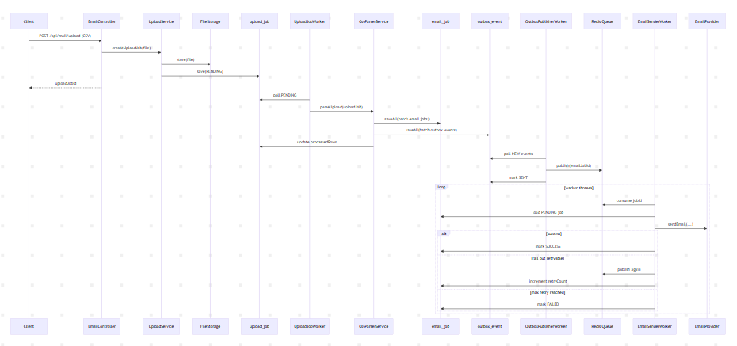

# Mail Service Flow

This document describes the actual processing flow of the current project based on the implementation and the benchmark artifacts already present in the repository. Its purpose is to make the following clear:

- Which stages a request goes through
- Which states are stored in the database
- Where the likely bottlenecks are in Phase 1
- Which parts should be optimized next

## 1. Current End-to-End Flow

The pipeline is currently split into five stages:

1. The client uploads a CSV file through `POST /api/mail/upload`
2. `UploadService` stores the file and creates an `upload_job`
3. `UploadJobWorker` polls `upload_job`, parses the CSV, and writes batches
4. Each batch creates `email_job` and `outbox_event` records
5. `OutboxPublisherWorker` publishes events to Redis
6. `EmailSenderWorker` consumes the queue, sends emails, and retries when needed

### Overview diagram

```text
Client
  |
  v
POST /api/mail/upload
  |
  v
UploadService
  |----------------------> Local file storage
  |
  v
upload_job (PENDING)
  |
  v
UploadJobWorker (fixedDelay polling)
  |
  v
CsvParserService
  |
  +--> email_job (PENDING)
  |
  +--> outbox_event (NEW)
          |
          v
    OutboxPublisherWorker (fixedDelay polling)
          |
          v
      Redis queue
          |
          v
   EmailSenderWorker x N
          |
          v
   EmailProvider / AWS SES
          |
          v
email_job -> SUCCESS / FAILED
```

### Sequence diagram



## 2. Stage-by-Stage Details

### Stage 1: Upload API

- Current endpoint: `POST /api/mail/upload`
- Input: `multipart/form-data`, field name `file`
- If the file is empty, the API returns `400`
- If valid, the API returns `uploadJobId`

The purpose of this stage is to return quickly instead of making the client wait for CSV parsing and email delivery.

### Stage 2: Create `upload_job`

Right after file storage, the system creates an `upload_job` record:

- `status = PENDING`
- `totalRows = 0`
- `processedRows = 0`
- `filePath = stored file path`

Current `upload_job` states:

- `PENDING`
- `PROCESSING`
- `COMPLETED`
- `FAILED`

### Stage 3: Parse CSV in batches

`UploadJobWorker` polls the database using `worker.upload-job.delay-ms`. When it finds a `PENDING` job, it:

1. Changes status to `PROCESSING`
2. Counts valid rows in the file
3. Reads the CSV while skipping the header
4. For each valid email, creates:
   - one `email_job`
   - one `outbox_event`
5. Persists data in batches using `saveAll`
6. Updates `processedRows`
7. Sets `upload_job = COMPLETED` when finished

Benefits:

- Fewer DB writes than one-row-at-a-time insertion
- Parsing is decoupled from sending

Important note:

- Each batch still reloads `upload_job` to update progress
- That is a clear source of overhead in Phase 1

### Stage 4: Outbox publishing

`OutboxPublisherWorker` polls `outbox_event` rows with status `NEW` using `worker.outbox.delay-ms`.

Each event is processed as follows:

1. Read `payload` as `emailJobId`
2. Push it into the Redis list queue
3. Mark the event as `SENT`

Why the outbox matters:

- It separates DB persistence from queue publishing
- It reduces the risk of losing events while parsing and sending remain decoupled

### Stage 5: Send email and retry

`EmailSenderWorker` starts multiple threads based on `worker.email-sender.threads`.

Each worker:

1. Waits for a message from Redis
2. Loads `email_job`
3. If the job is still `PENDING`, calls `EmailProvider.sendEmail(...)`
4. On success:
   - updates status to `SUCCESS`
5. On failure:
   - increments `retryCount`
   - republishes to the queue if still below `email.retry.max`
   - marks the job as `FAILED` if retry limit is reached

Current `email_job` states:

- `PENDING`
- `SUCCESS`
- `FAILED`

## 3. Why This Async Pipeline Was Chosen

Compared to a synchronous flow that sends immediately while reading the CSV, the current architecture is stronger from a system design perspective:

- The API is not blocked by email sending
- DB writes can be batched
- Queue-based handoff separates producer and consumer concerns
- Email sending can scale by increasing worker count
- The design can grow into tracking, retries, metrics, and DLQ support

This is a better fit for a service that is expected to become operationally mature instead of remaining a simple synchronous endpoint.

## 4. Benchmark Findings And Meaning

The repository currently includes two benchmark layers:

### `AsyncPipelineBenchmarkTest`

- Runs in memory
- Validates the architectural idea that async + multiple workers should beat sync for IO-bound work
- Does not include the full cost of DB access, scheduling, or real Redis interaction

### `LocalInfraPerformanceTest`

- Runs through the real Spring context
- Uses `UploadService`, JPA repositories, Redis queue, worker scheduling, and retry policy
- Measures behavior that is closer to actual local infrastructure

Current local infrastructure report:

```text
LOCAL_SEQUENTIAL durationMs=5125 total=240 success=228 failed=12 retried=24 successRate=95.00% failureRate=5.00% retryRate=10.00% throughput=46.83 emails/s attempts=0 pendingOutbox=0
LOCAL_ASYNC_PIPELINE durationMs=11926 total=240 success=228 failed=12 retried=12 successRate=95.00% failureRate=5.00% retryRate=5.00% throughput=20.12 emails/s attempts=285 pendingOutbox=0
local_speedup=0.43x
```

### Interpretation

- The async pipeline is functionally correct because final success and failure counts match the sequential baseline
- The async pipeline is slower than the local baseline in Phase 1
- The main likely bottlenecks are:
  - worker polling delay
  - DB round-trips for progress updates
  - queue handoff and per-job repository lookup

Important conclusion:

- The architecture is correct for future scaling
- Real performance still requires a serious optimization pass

## 5. Most Likely Phase 1 Bottlenecks

### Polling-based orchestration

- `UploadJobWorker` and `OutboxPublisherWorker` depend on `fixedDelay`
- Even small delays create waiting time that adds no business value

### DB progress updates

- Every batch performs `findById(upload_job)` followed by `save`
- The cost grows with the number of batches

### Queue consumption strategy

- The queue currently uses `leftPop(..., Duration.ofSeconds(5))`
- In practice this is still timeout-based polling, not a richer streaming or ack-based approach

### Per-job repository access

- Each message loads `email_job` from the database before sending
- As throughput grows, DB access can become a bottleneck

## 6. Recommended Optimization Priorities

### A. Observability first

Add:

- timestamps per stage
- metrics per upload job
- worker throughput and latency
- dashboards or at least structured logs

Without measurement, later optimization becomes guesswork.

### B. Coordination optimization

- Reduce polling
- Move toward more event-driven consumption
- Consider Redis Streams or another broker with stronger ack/retry semantics

### C. Write-path optimization

- Increment `processedRows` with an update query
- Add indexes for frequently filtered status fields
- Reduce repeated entity reloads inside transactions

### D. API and operational improvements

- Add status endpoint by `uploadJobId`
- Add aggregate upload statistics endpoint
- Return JSON instead of plain text
- Add CSV schema, file type, and file size validation

## 7. What Phase 1 Leaves For Phase 2

The most valuable outputs already exist:

- A working end-to-end processing flow
- A clear persistence model for tracking and retries
- A benchmark suite for before/after comparison
- A provider abstraction ready for AWS SES

That is a solid base for the next phase. The right next move is not rewriting everything, but optimizing systematically using metrics and benchmark comparisons.

## 8. Local Infrastructure Benchmark Command

Requirements:

1. MySQL must be running with the configured connection settings
2. Redis must be running on `localhost:6379`

Command:

```powershell
.\mvnw.cmd -Drun.local.infra.tests=true -Dtest=LocalInfraPerformanceTest test
```

The Phase 2 goal should be to rerun this exact command after each optimization pass and compare the results against the same workload.
